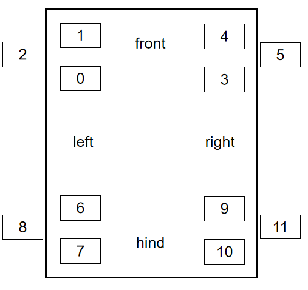
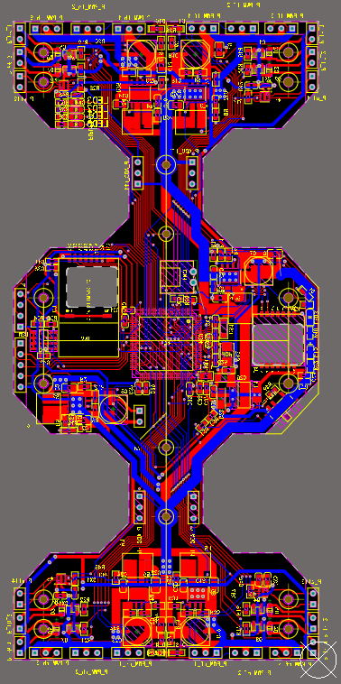

# VER: PCB_3.6_V6
## 主要文件说明
gait.c——步态，CLASSMC_setJointPosition()电机接口赋值，初始化参数

pwm.c——pwm接口定义

SV.c——气路控制

SV.h——气路接口定义

VOFA.c——vofa+通信协议

<u>注意：如不焊接通信模块，需注释main.c中相关调用代码。</u>

## 肩关节安装及初始化
1.	安装锥齿轮前，需将**gait.c**中的ftsZeroSet参数全部赋值为0，以及将当前初始gaitMode对应的参数（offset90 / offset180 / offset180Turn）注释掉，赋值为0。下载程序，电机通电复位后再进行安装。或者使用上位机进入复位调零模式，调好参数后再写入程序。
2.	安装时保证腿部各关节间呈90度。
3.	安装完后，使用ftsZeroSet参数对电机零位进行微调，进一步保证腿部各关节间呈90度。
4.	机器人运行前，将当前初始gaitMode对应的参数（offset90 / offset180 / offset180Turn）的注释取消掉。

## 接线表
| PCB丝印  | 芯片控制引脚 |  实物   |
| :------: | :----------: | :-----: |
| PWM_lf_1 |     PB6      | motor0  |
| PWM_lf_2 |     PB7      | motor1  |
| PWM_lf_3 |     PD14     | motor2  |
| SV_lf_1  |     PC4      | 进气阀  |
| SV_lf_2  |     PC5      | 出气阀  |
| SV_all1  |     PB1      |   泵    |
| PWM_rf_1 |     PE9      | motor3  |
| PWM_rf_2 |     PE11     | motor4  |
| PWM_rf_3 |     PE13     | motor5  |
| SV_rf_1  |     PC0      | 进气阀  |
| SV_rf_2  |     PC1      | 出气阀  |
| SV_all2  |     PB2      |   泵    |
| PWM_lh_1 |     PB14     | motor6  |
| PWM_lh_2 |     PB15     | motor7  |
| PWM_lh_3 |     PE5      | motor8  |
| SV_lh_1  |     PC6      | 进气阀  |
| SV_lh_2  |     PC7      | 出气阀  |
| SV_all3  |     PB3      |   泵    |
| PWM_rh_1 |     PA6      | motor9  |
| PWM_rh_2 |     PA7      | motor10 |
| PWM_rh_3 |     PB0      | motor11 |
| SV_rh_1  |     PC2      | 进气阀  |
| SV_rh_2  |     PC3      | 出气阀  |
| SV_all4  |     PB4      |   泵    |

## 电机编号

## 实物图

front

left

right

  

hind

## 通信指令

展开查看

%%为4字节浮点数，X为HEX
<pre><code>
启动
23 02 00 00 00 00 01 AA

停止
23 02 00 00 00 00 00 AA

x方向速度
23 02 01 %% AA

y方向速度
23 02 02 %% AA

alpha转向速度
23 02 03 %% AA

运行周期
23 02 04 %% AA

四足下压距离（LF RF LH RF）
23 02 05 XX XX XX XX AA

90对角步态
23 02 06 00 00 00 00 AA

90缓步步态
23 02 06 00 00 00 01 AA

180对角步态
23 02 06 00 00 00 02 AA

180缓步步态
23 02 06 00 00 00 03 AA

90外弧面对角步态
23 02 06 00 00 00 04 AA

90外弧面缓步步态
23 02 06 00 00 00 05 AA

90内弧面对角步态
23 02 06 00 00 00 06 AA

90内弧面缓步步态
23 02 06 00 00 00 07 AA

90缓步步态-后爬
23 02 06 00 00 00 08 AA

180对角步态-转弯
23 02 06 00 00 00 09 AA

180缓步步态-转弯
23 02 06 00 00 00 0A AA

</code></pre>

## 链接
### Qt上位机

1. 通信模块：24LC01

   通信频段：2.4Ghz

   https://github.com/vvzacharyvv/QT-ibss-robot-uppercomputer/tree/master

2. 通信模块：SIP通信模块

   通信协议：udp

   https://github.com/vvzacharyvv/ibss-UdpClient
